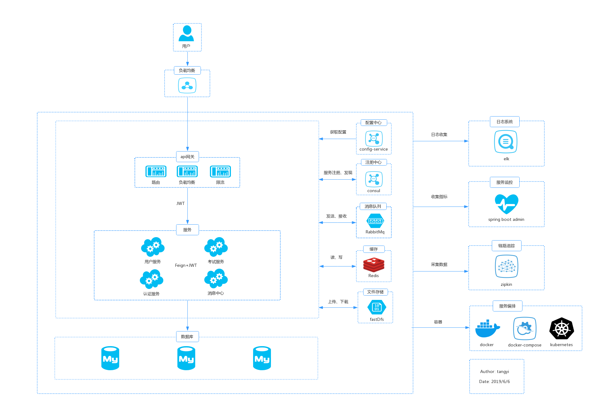
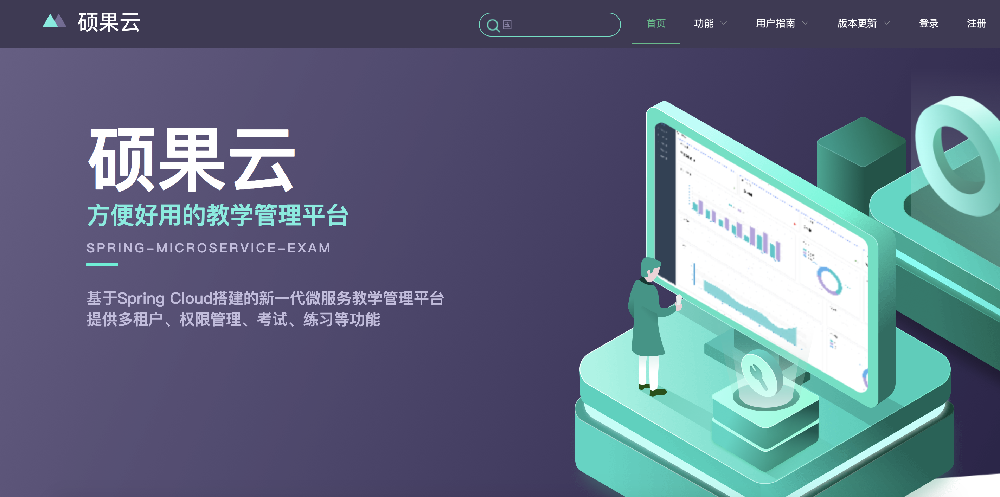

# 1 简介

硕果云，基于Spring Cloud搭建的新一代微服务教学管理平台，提供多租户、权限管理、考试、练习等功能。

# 2 在线体验

- 前台：[http://118.25.138.130](http://118.25.138.130)

- 后台：[http://118.25.138.130:81](http://118.25.138.130:81)

账号：

|   单位ID   |      账号      |   密码   |   角色    |
| --------- | -------- | -------- | -------- |
|  gitee  |  admin    | 123456  |  管理员  |
|  gitee  |  student  | 123456  |  学生  |
|  gitee  |  teacher  | 123456  |  老师  |

# 3 技术选型

- 服务注册与发现：`Consul`
- 熔断器：`Hystrix` + `Turbine`
- 客户端负载均衡：`Ribbon`
- 内部服务调用：`Feign`
- 网关：`Spring Cloud Gateway`
- 认证鉴权：`Spring Cloud OAuth2` + `JWT`
- 程序监控：`Spring Boot Admin` / `Spring Boot Actuator`
- 分布式配置中心：`Spring Cloud Config`
- 分布式调用链监控：`Spring Cloud Sleuth` + `Zipkin`
- 数据库：`MySQL 5.7`
- 部署：`Docker` + `docker-compose`
- 构建工具：`Maven`
- 后台 API 文档：`Swagger`
- 消息队列：`RabbitMQ`
- 文件系统：`FastDFS`
- 缓存：`Redis`
- 前端：`vue`

# 4 核心依赖

|      名称      |   版本    |
| --------- | -------- |
| `Spring Boot`    | `2.1.11.RELEASE`  |
| `Spring Cloud`   | `Greenwich.SR4`  |

# 5 系统架构

# 6 功能概述

项目分前台网站和后台管理两部分，前台主要提供考试功能，后台提供基础管理、考试管理功能。

前台主要提供在线考试、在线学习功能

后台管理分为：系统管理、系统监控、考务管理、附件管理、个人管理

系统管理：提供用户、部门、角色、权限等基础管理
- 用户管理：用户信息增删改查、导入导出
- 部门管理：部门信息增删改查
- 角色管理：角色信息增删改查、分配权限
- 菜单管理：菜单信息增删改查、导入导出
- 终端管理：管理OAuth2.0的客户端，如client_id、client_secret、access_token有效时间等
- 路由管理：网关路由管理，包括路由的增删改查、刷新路由等

系统监控：监控服务、日志等
- 日志监控：查看系统日志
- `consul`监控：`consul`服务监控
- `zipkin`监控：监控服务的调用链路
- 服务监控：`spring boot admin`服务监控
- 接口文档：`swagger api`文档

考务管理：提供课程、考试、题库、成绩等管理
- 课程管理：课程信息增删改查
- 考试管理：考试信息增删改查、题目管理、发布回收，题目管理支持简单文本、富文本输入、从题库添加等
- 题库管理：题目分类增删改查、题目信息增删改查
- 成绩管理：查看成绩、导出成绩
- 知识库：知识库增删改查、上传附件

附件管理：项目的所有附件存储在`fastDfs`里，提供统一的管理入口
- 附件列表：管理所有附件，如用户头像、考试附件、知识库附件等。

个人管理：管理个人资料和修改密码
- 个人资料：姓名、头像等基本信息的修改
- 修改密码：修改密码

# 7 功能演示

## 7.1 前台功能

1. 首页

2. 考试

3. 查看错题

## 7.2 后台功能

1. 总体功能

2. 考试管理

3. 题目管理

4. 个人资料

# 8 问题反馈

欢迎提交 issue，请写清楚遇到问题的原因、浏览器、操作系统环境、重现的流程和报错日志等。 

如果有开发能力，建议在本地调试出出错的代码。

# 9 参考资料

- [在线考试系统-部署文档](https://www.kancloud.cn/tangyi/spring-microservice-exam/1322870)

- [在线考试系统-部署文档(docker版)](https://www.kancloud.cn/tangyi/spring-microservice-exam/1322869)

- [在线考试系统-数据库设计](https://www.kancloud.cn/tangyi/spring-microservice-exam/1322868)

- [微服务架构下的安全设计方案](http://ehedgehog.net/2019/03/23/%E5%BE%AE%E6%9C%8D%E5%8A%A1%E6%9E%B6%E6%9E%84%E4%B8%8B%E7%9A%84%E5%AE%89%E5%85%A8%E8%AE%BE%E8%AE%A1%E6%96%B9%E6%A1%88/)

- [在线考试系统V3.0镜像构建、推送、部署](http://ehedgehog.net/2019/04/22/%E5%9C%A8%E7%BA%BF%E8%80%83%E8%AF%95%E7%B3%BB%E7%BB%9FV2.0%E9%95%9C%E5%83%8F%E6%9E%84%E5%BB%BA%E3%80%81%E6%8E%A8%E9%80%81%E3%80%81%E9%83%A8%E7%BD%B2/)

***

# 10 关于

交流QQ群：

QQ群号：

996208878(已满)

346164822（新群）

如果您觉得有帮助，请点右上角 "Star" 或者项目底部的“捐助”支持一下，谢谢！