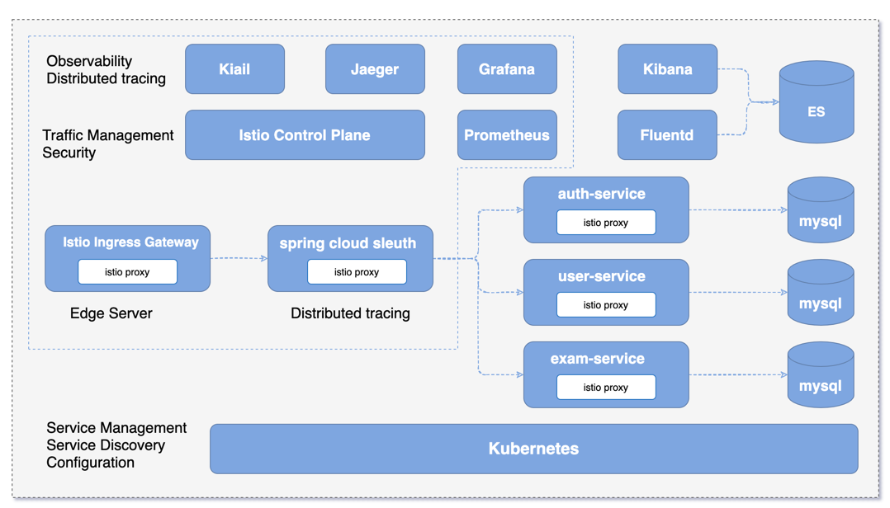

<h1 align="center">Welcome to sg-exam 👋</h1>

  
  
  

> 硕果云，基于Spring Boot、Kubernetes、Istio搭建的云原生Service Mesh教学管理平台，提供多租户、权限管理、在线考试、练习等功能
>
> 题型支持单选题、多选题、不定项选择题、判断题、简答题
>
> 支持PC、H5、微信小程序（小程序后面开源）
>
> 可选Spring Cloud版本（spring-cloud分支）、Service Mesh（master分支）

### 🏠 [主页](https://gitee.com/wells2333/sg-exam)

### ✨ [在线体验-前台(http://two.404forever.com)](http://two.404forever.com/)

### ✨ [在线体验-后台(http://two.404forever.com/admin)](http://two.404forever.com/admin)

账号：

|   单位ID   |      账号      |   密码   |   角色    |
| --------- | -------- | -------- | -------- |
|  gitee  |  preview  | 123456  |  预览权限|
|  gitee  |  student  | 123456  |  学生  |
|  gitee  |  teacher  | 123456  |  老师  |

## 技术选型

- 微服务基础设施：`Istio`
- 认证鉴权：`Spring Security OAuth` + `JWT`
- 数据库：`MySQL 5.7`
- 缓存：`Redis`
- 构建工具：`Gradle`
- 部署：`k8s`、`docker-compose`、`istio`
- 后台 API 文档：`Swagger`
- 文件系统：`本地目录`、`七牛云`、`FastDfs`
- 前端：`Vue`
- 小程序：`wepy`

## 核心依赖

|      名称      |   版本    |
| --------- | -------- |
| `Spring Boot`    | `2.2.5.RELEASE`  |
| `Istio`   | `1.5.4`  |
| `Kubernetes`   | `1.1.6`  |

## 系统架构

## 功能概述

项目分前台网站和后台管理两部分，前台主要提供考试功能，后台提供基础管理、考试管理功能。

前台主要提供在线考试、在线学习功能

后台管理分为：首页监控、系统管理、系统监控、考务管理、附件管理、个人管理

首页监控：提供系统租户数、用户数、考试数、近七天考试记录数等监控

系统管理：提供用户、部门、角色、权限等基础管理
- 用户管理：用户信息增删改查、导入导出
- 部门管理：部门信息增删改查
- 角色管理：角色信息增删改查、分配权限
- 菜单管理：菜单信息增删改查、导入导出
- 终端管理：管理OAuth2.0的客户端，如client_id、client_secret、access_token有效时间等
- 路由管理：网关路由管理，包括路由的增删改查、刷新路由等

系统监控：监控服务、日志等
- 日志监控：查看系统日志
- 接口文档：`swagger api`文档

考务管理：提供课程、考试、题库、成绩等管理
- 课程管理：课程信息增删改查
- 考试管理：考试信息增删改查、题目管理、发布回收，题目管理支持简单文本、富文本输入、从题库添加等，题型支持单选题、多选题、不定项选择题、判断题、简答题，生成二维码分享
- 题库管理：题目分类增删改查、题目信息增删改查，题型支持单选题、多选题、不定项选择题、判断题、简答题
- 成绩管理：查看成绩、成绩批改、导出等功能
- 知识库：知识库增删改查、上传附件

附件管理：项目的所有附件存储在`fastDfs`里，提供统一的管理入口
- 附件列表：管理所有附件，如用户头像、考试附件、知识库附件等，存储方式支持服务器本地目录、`fastDfs`，七牛云

个人管理：管理个人资料和修改密码
- 个人资料：姓名、头像等基本信息的修改
- 修改密码：修改密码

## 系统截图

### 前台功能（点击查看大图）

<table>
	<tr>
	    <td></td>
        <td></td>
    </tr>
    <tr>
        <td></td>
        <td></td>
    </tr>
    <tr>
        <td></td>
        <td></td>
    </tr>
    <tr>
        <td></td>
        <td></td>
    </tr>
</table>

### 后台功能（点击查看大图）

<table>
	<tr>
        <td></td>
        <td></td>
    </tr>
    <tr>
        <td></td>
        <td></td>
    </tr>
    <tr>
        <td></td>
        <td></td>
    </tr>
    <tr>
        <td></td>
        <td></td>
    </tr>
    <tr>
        <td></td>
        <td></td>
    </tr>
</table>

### 系统监控（点击查看大图）

<table>
    <tr>
        <td></td>
        <td></td>
    </tr>
    <tr>
        <td></td>
        <td></td>
    </tr>
    <tr>
        <td></td>
        <td></td>
    </tr>
</table>

## 部署文档

- [在线考试系统-部署文档](https://www.kancloud.cn/tangyi/sg-exam/1322870)

- [部署视频教程](https://www.kancloud.cn/tangyi/sg-exam/1519487)

- [在线考试系统-部署文档(docker版)](https://www.kancloud.cn/tangyi/sg-exam/1322869)

- [在线考试系统-数据库设计](https://www.kancloud.cn/tangyi/sg-exam/1322868)

## 参考资料

- [开源项目分析解读——基于Spring Cloud的在线考试系统](https://blog.csdn.net/chengqiuming/article/details/102991984)

## 作者

👤 **tangyi**

* Gitee: [@wells2333](https://gitee.com/wells2333)

* Github: [@wells2333](https://github.com/wells2333)

## 🤝 参与贡献

欢迎提交PR、[issues](https://gitee.com/wells2333/sg-exam/issues)一起完善项目

## 反馈交流

微信交流群：

 
 
QQ交流群：

     
 
## 请作者喝咖啡

如果您觉得有帮助，请点右上角 ⭐️ "Star" 或者**微信扫一扫**支持一下，谢谢！

 

***
