## spring-microservice-exam

- 在线体验-前台：[http://www.it99.club](http://www.it99.club)

- 在线体验-后台：[http://www.it99.club:81](http://www.it99.club:81)

交流QQ群：996208878

如果您觉得有帮助，请点右上角 "Star" 或者项目底部的“捐助”支持一下，谢谢！

项目源码地址

- 前台ui：[spring-microservice-exam-web](https://gitee.com/wells2333/spring-microservice-exam-web.git)
- 后台ui：[spring-microservice-exam-ui](https://gitee.com/wells2333/spring-microservice-exam-ui.git)
- 后端：[spring-microservice-exam](https://gitee.com/wells2333/spring-microservice-exam.git)

## 简介

- 重写[spring-cloud-online-exam](https://gitee.com/wells2333/spring-cloud-online-exam)

- 采用前后端分离技术

- 前端采用`vue2.0`，通过`jwt`和后端交互

- 后端基于`spring boot`、`spring cloud`、`MySQL`等技术实现权限管理、考试管理等功能。

默认账号：

1. 管理员：admin/123456
2. 学生：student/123456
3. 教师：teacher/123456

## 技术选型

- 服务注册与发现：`Consul`
- 熔断器：`Hystrix` + `Turbine`
- 客户端负载均衡：`Ribbon`
- 内部服务调用：`Feign`
- 网关：`Spring Cloud Gateway`
- 认证鉴权：`Spring Cloud OAuth2` + `JWT`
- 程序监控：`Spring Boot Admin` / `Spring Boot Actuator`
- 分布式配置中心：`Spring Cloud Config`
- 分布式调用链监控：`Spring Cloud Sleuth` + `Zipkin`
- 数据库：`MySQL 5.7`
- 部署：`Docker`
- 构建工具：`Maven`
- 后台 API 文档：`Swagger`
- 消息队列：`RabbitMQ`
- 文件系统：`FastDFS`
- 缓存：`Redis`
- 前端：`vue`

## 核心依赖

|      名称      |   版本    |
| --------- | -------- |
| `Spring Boot`    | `2.1.3.RELEASE`  |
| `Spring Cloud`   | `Greenwich.SR1`  |

## 系统架构

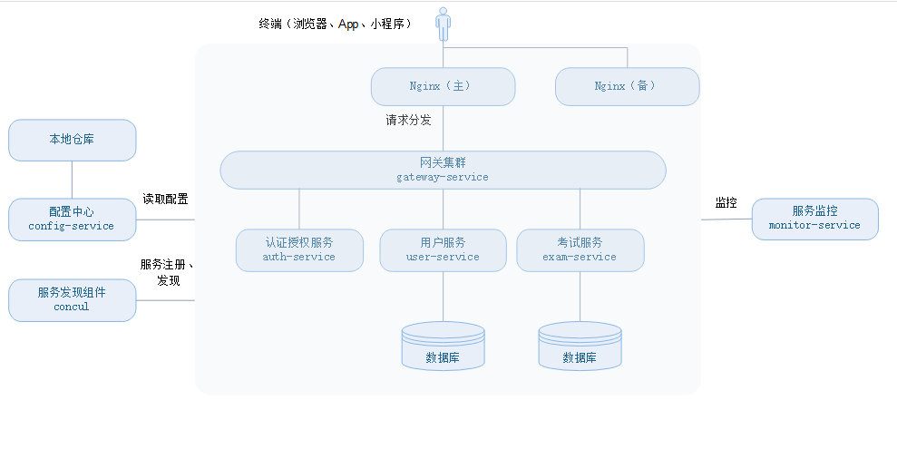

## 功能概述

项目分前台网站和后台管理两部分，前台主要提供考试功能，后台提供基础管理、考试管理功能。

前台主要提供在线考试、在线学习功能

后台管理分为：系统管理、系统监控、考务管理、附件管理、个人管理

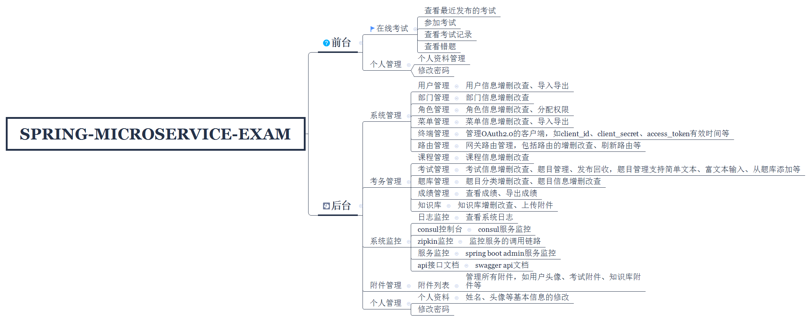

- [在线考试系统V2.0功能概述](doc/在线考试系统V2.0_功能概述.md)

## 功能演示

### 前台功能

1. 登录

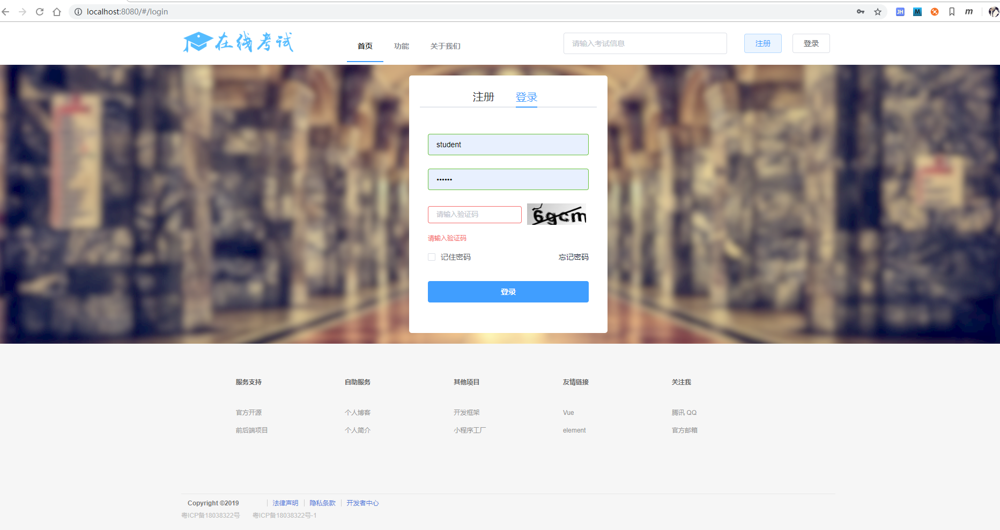

2. 考试

3. 答题卡
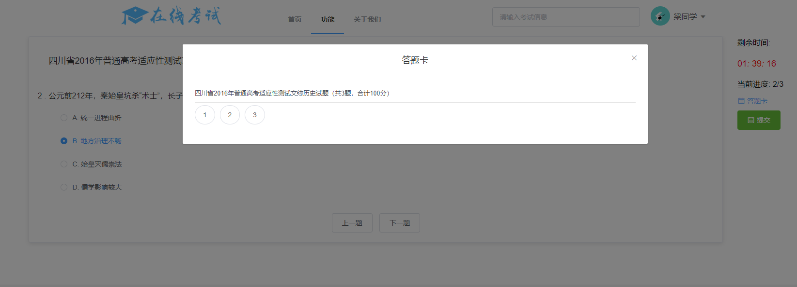

4. 查看成绩
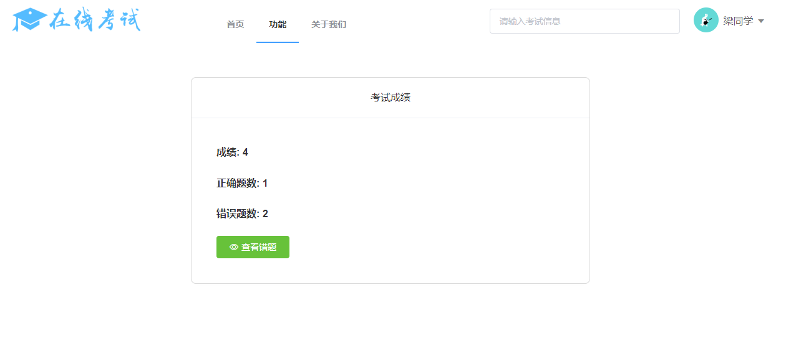

5. 查看错题
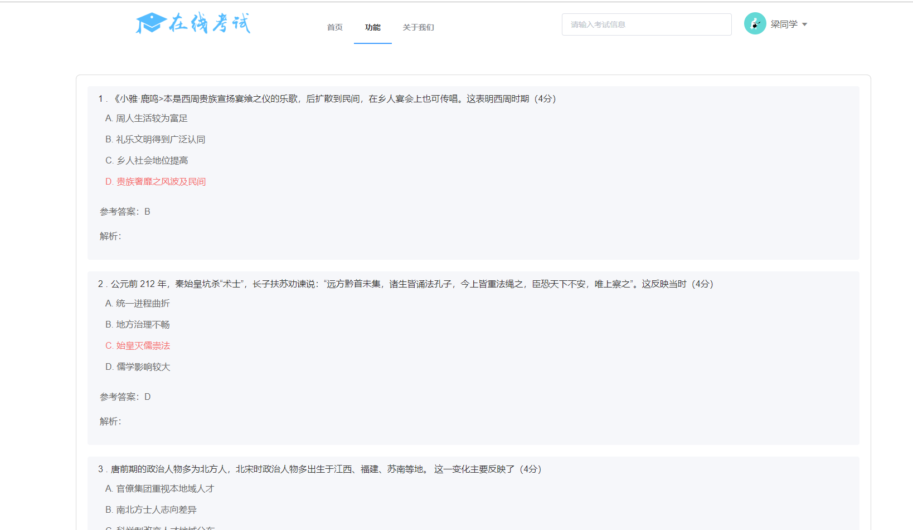

### 后台功能

1. 总体功能
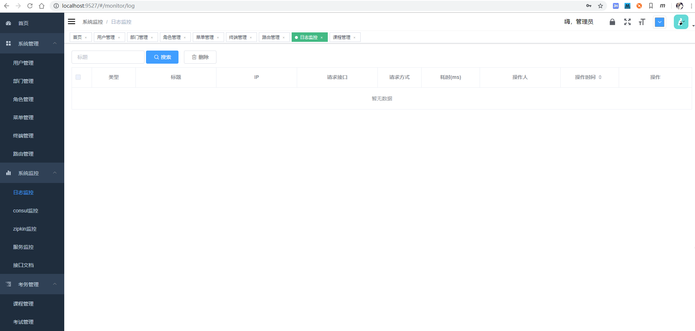

2. 考试管理
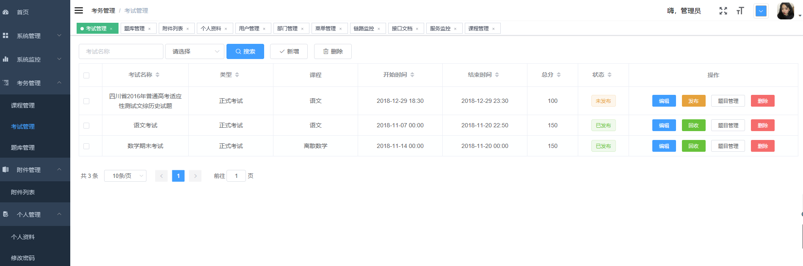

3. 题目管理
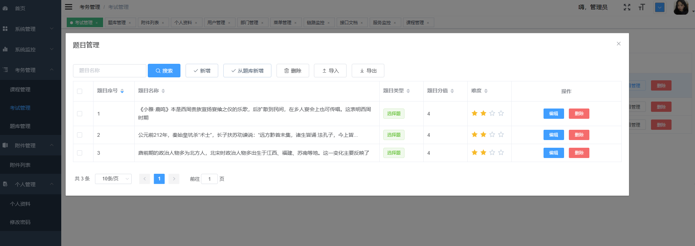

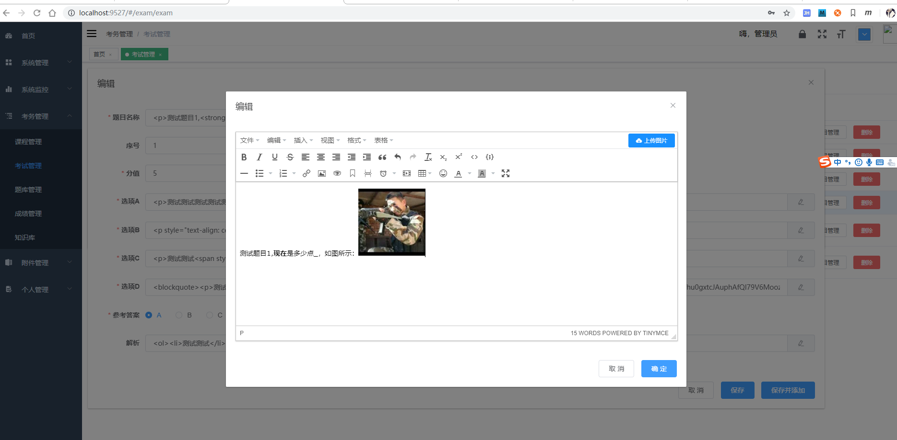

4. 题库管理
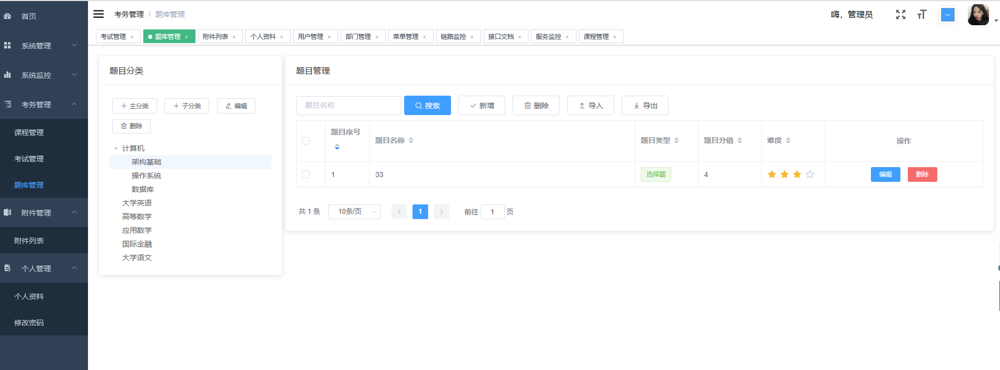

5. 个人资料
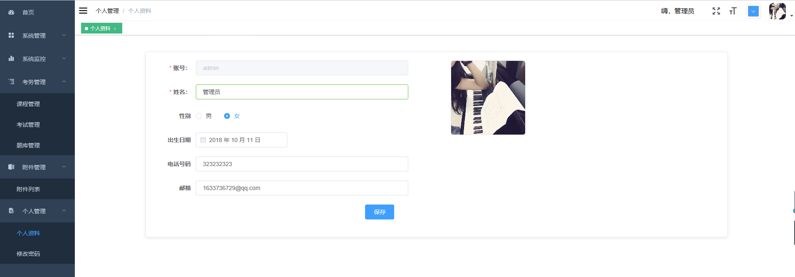

## 部署文档

[在线考试系统部署文档](doc/在线考试系统V2.0_部署文档.md)

[基于docker-compose部署](doc/在线考试系统V2.0_部署文档(docker版).md)

## 后续

- [ ] 多租户
- [ ] 作业、考试、知识点管理、考试成绩排名、图表展示
- [ ] 学生签到、请假
- [ ] 短信验证码，第三方登录
- [ ] swagger修复
- [ ] 站内信
- [x] jwt只存userId这些关键信息，各服务鉴权需要重新换取token
- [x] 重构部门角色，用户直接绑定角色，部门不关联角色
- [x] 简答题，题库完善，智能组卷，在线学习，成绩排名

## 问题反馈

欢迎提交 issue，请写清楚遇到问题的原因、浏览器、操作系统环境、重现的流程和报错日志等。 

如果有开发能力，建议在本地调试出出错的代码。

## 参考资料

- [在线考试系统V2.0部署文档](doc/在线考试系统V2.0_部署文档.md)

- [在线考试系统V2.0部署文档(docker版)](doc/在线考试系统V2.0_部署文档(docker版).md)

- [在线考试系统V2.0项目结构说明文档](doc/在线考试系统V2.0_项目结构说明.md)

- [微服务架构下的安全设计方案](http://ehedgehog.net/2019/03/23/%E5%BE%AE%E6%9C%8D%E5%8A%A1%E6%9E%B6%E6%9E%84%E4%B8%8B%E7%9A%84%E5%AE%89%E5%85%A8%E8%AE%BE%E8%AE%A1%E6%96%B9%E6%A1%88/)

- [在线考试系统V2.0镜像构建、推送、部署](http://ehedgehog.net/2019/04/22/%E5%9C%A8%E7%BA%BF%E8%80%83%E8%AF%95%E7%B3%BB%E7%BB%9FV2.0%E9%95%9C%E5%83%8F%E6%9E%84%E5%BB%BA%E3%80%81%E6%8E%A8%E9%80%81%E3%80%81%E9%83%A8%E7%BD%B2/)

***

## 关于

作者：1633736729@qq.com