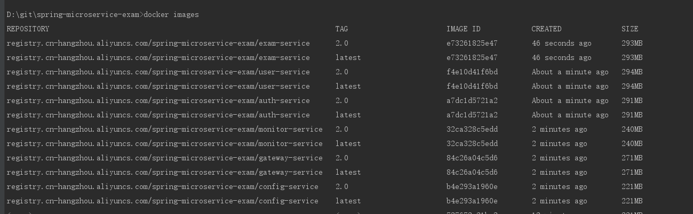
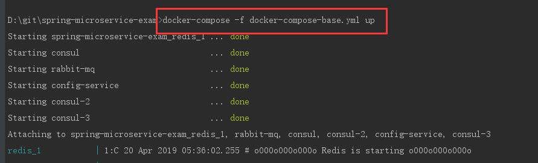
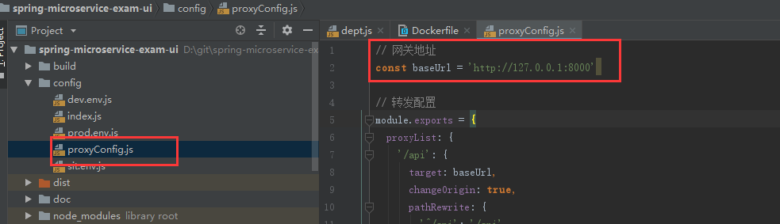
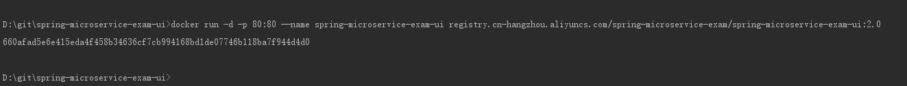
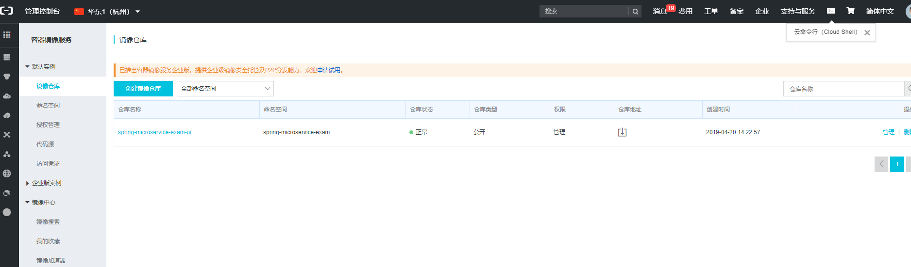
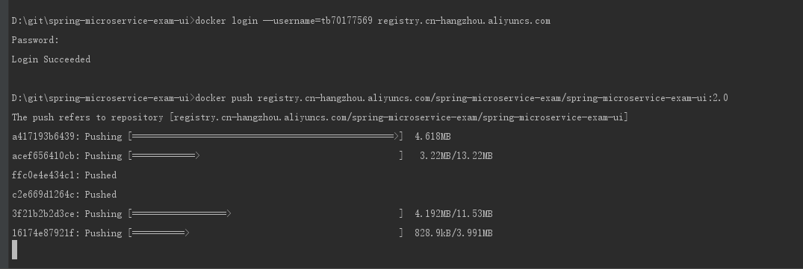
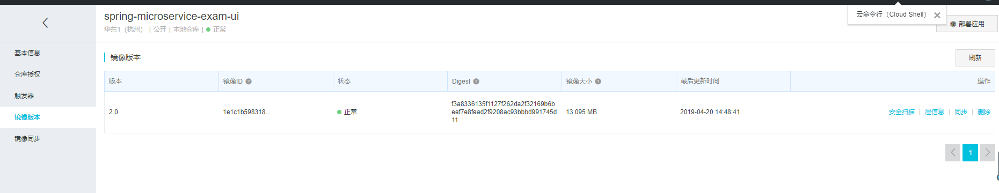
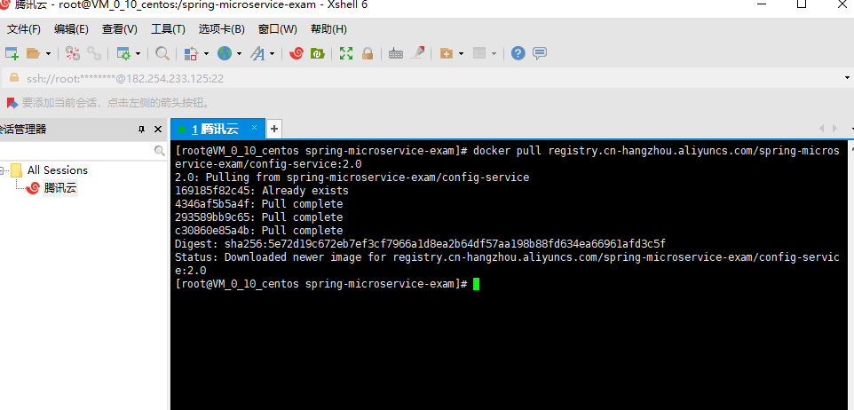

主要介绍如何基于docker、docker-compose部署后端项目、前端项目，主要的步骤是本地构建镜像，推送的远程仓库，远程服务器从远程仓库拉去镜像运行

## 安装docker、docker-compose

linux系统安装`docker`、`docker-compose`

windows系统安装`Docker for Windows`

## 部署后端项目

### 安装MySQL

MySQL需要单独安装，创建数据库和执行初始化脚本：

`/doc/deploy/mysql/microservice-user.sql`

`/doc/deploy/mysql/microservice-exam.sql`

`/doc/deploy/mysql/microservice-auth.sql`

### 安装fastDfs

非必须，如果需要用到附件上传的相关功能才安装

基于`docker`安装`fastDfs`，网上有教程

### 修改配置

修改`docker-compose.env`，其它基本不用修改

包括数据库IP、端口、用户名和密码，fastDfs的IP、端口


### 构建镜像

在`spring-microservice-exam`目录下运行：

```
mvn clean package -DskipTests=true docker:build
```


构建成功：



### 运行

1. 运行基础镜像（consul、redis、rabbitMq、config-service）

```
docker-compose -f docker-compose-base.yml up -d
```

`-d`表示后台运行



2. 运行服务镜像（gateway-service、auth-service、user-service、exam-service）

```
docker-compose -f docker-compose-services.yml up -d
```

3. 检查是否启动成功

```
docker ps
```

也可以访问`localhost:8500`查看服务是否注册成功

4. 停止运行

以基础镜像为例：

```
docker-compose -f docker-compose-base.yml stop
```

## 部署前端项目

以`spring-microservice-exam-ui`为例，`spring-microservice-exam-web`同理

### 修改配置

修改`spring-microservice-exam-ui/config/proxyConfig.js`里的后端api网关地址，一般情况下是不需要修改的



### 打包

在`spring-microservice-exam-ui`目录下运行：

```
npm run build
```

运行成功后会生成`dist`目录，里面是项目的静态资源

### 构建镜像

在`spring-microservice-exam-ui`目录下运行：

```
docker build -t registry.cn-hangzhou.aliyuncs.com/spring-microservice-exam/spring-microservice-exam-ui:2.0 .
```


### 运行

运行：

```
docker run -d -p 80:80 --name spring-microservice-exam-ui registry.cn-hangzhou.aliyuncs.com/spring-microservice-exam/spring-microservice-exam-ui:2.0
```



## 推送到至远程仓库

以阿里云为例：

在容器镜像服务菜单下，新建镜像仓库`spring-microservice-exam-ui`



推送镜像



推送成功



## 远程服务器拉去镜像运行

```
docker pull registry.cn-hangzhou.aliyuncs.com/spring-microservice-exam/spring-microservice-exam-ui:2.0
```



```
docker run -d -p 80:80 --name spring-microservice-exam-ui registry.cn-hangzhou.aliyuncs.com/spring-microservice-exam/spring-microservice-exam-ui:2.0
```

基于docker-compose运行后端项目:

```
docker-compose -f docker-compose-base.yml up -d
```

```
docker-compose -f docker-compose-services.yml up -d
```

## 参考资料

待补充
