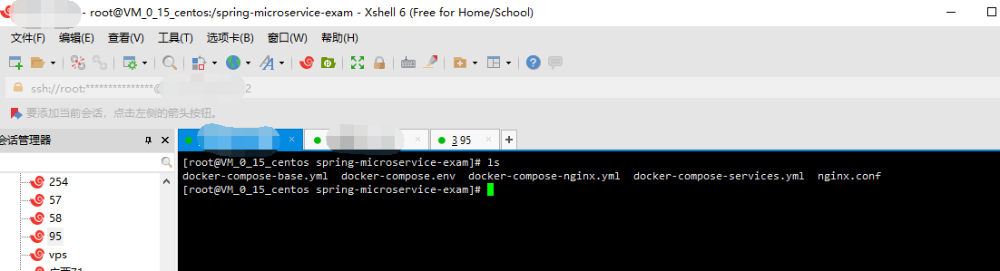

主要介绍如何基于docker、docker-compose部署后端项目、前端项目，主要的步骤是本地构建镜像，推送的远程仓库，远程服务器从远程仓库拉去镜像运行

## 前提

- 服务器：2核4G、CentOS 7.2 64位

- 注册阿里云账号

## 安装MySQL

MySQL需要单独安装，创建数据库和执行初始化脚本：

`/doc/deploy/mysql/microservice-user.sql`

`/doc/deploy/mysql/microservice-exam.sql`

`/doc/deploy/mysql/microservice-auth.sql`

## 安装docker、docker-compose

linux系统安装`docker`、`docker-compose`

windows系统安装`Docker for Windows`

## 安装fastDfs

参考：[fastdfs文件系统单机环境搭建和spring boot整合](https://blog.csdn.net/baidu_36415076/article/details/79505027)

## 拉取镜像

1. 登录阿里云Docker Registry

```
docker login --username=你的阿里云账号 registry.cn-hangzhou.aliyuncs.com

如：

docker login --username=tb70177569 registry.cn-hangzhou.aliyuncs.com
```

2. 拉取镜像

拉取各服务的镜像：

```
后端镜像：
docker pull registry.cn-hangzhou.aliyuncs.com/spring-microservice-exam/config-service:2.0
docker pull registry.cn-hangzhou.aliyuncs.com/spring-microservice-exam/auth-service:2.0
docker pull registry.cn-hangzhou.aliyuncs.com/spring-microservice-exam/user-service:2.0
docker pull registry.cn-hangzhou.aliyuncs.com/spring-microservice-exam/exam-service:2.0
docker pull registry.cn-hangzhou.aliyuncs.com/spring-microservice-exam/gateway-service:2.0
docker pull registry.cn-hangzhou.aliyuncs.com/spring-microservice-exam/monitor-service:2.0

前端镜像：
docker pull registry.cn-hangzhou.aliyuncs.com/spring-microservice-exam/spring-microservice-exam-ui:2.0
docker pull registry.cn-hangzhou.aliyuncs.com/spring-microservice-exam/spring-microservice-exam-web:2.0
```

## 修改配置

将源码目录下的`docker-compose.env`、`docker-compose-base.yml`、`docker-compose-services.yml`、`docker-compose-nginx.yml`、`nginx.conf`上传到服务器的`/spring-microservice-exam/`目录下

目录结构：



修改`docker-compose.env`

包括数据库IP、端口、用户名和密码，fastDfs的IP、端口


## 运行

1. 按顺序执行：

```
运行基础服务：
docker-compose -f docker-compose-base.yml up -d

运行后端服务：
docker-compose -f docker-compose-services.yml up -d

运行前端服务：
docker-compose -f docker-compose-nginx.yml up -d
```

`-d`表示后台运行

2. 检查是否启动成功

```
docker ps
```

## 访问

前台地址：ip:80

后台地址：ip:81

## 参考资料

- [安装docker](https://www.cnblogs.com/yufeng218/p/8370670.html)

- [安装docker-compose](https://www.jianshu.com/p/94760f35c98c)

- [在线考试系统V2.0镜像构建、推送、部署](http://ehedgehog.net/2019/04/22/%E5%9C%A8%E7%BA%BF%E8%80%83%E8%AF%95%E7%B3%BB%E7%BB%9FV2.0%E9%95%9C%E5%83%8F%E6%9E%84%E5%BB%BA%E3%80%81%E6%8E%A8%E9%80%81%E3%80%81%E9%83%A8%E7%BD%B2/)