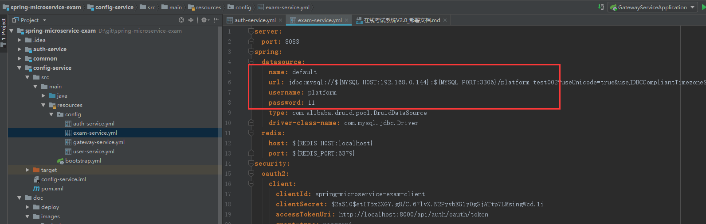
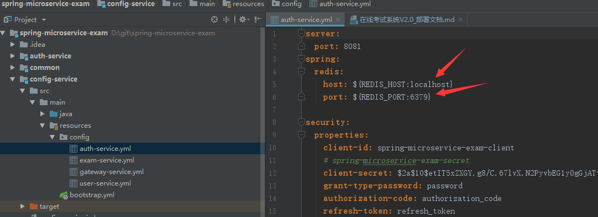
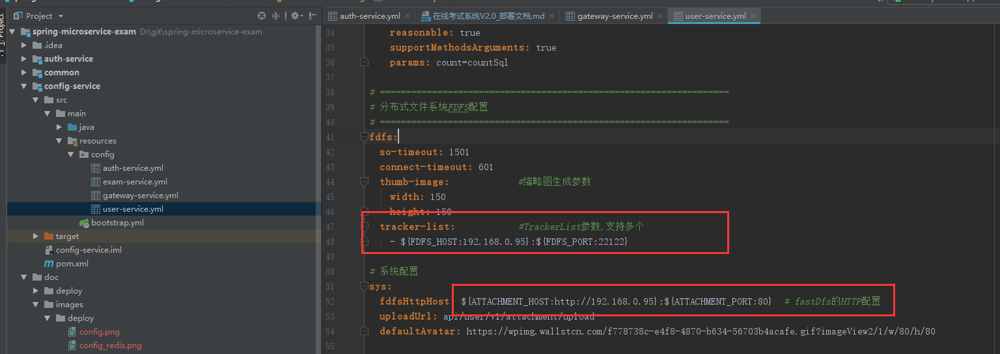
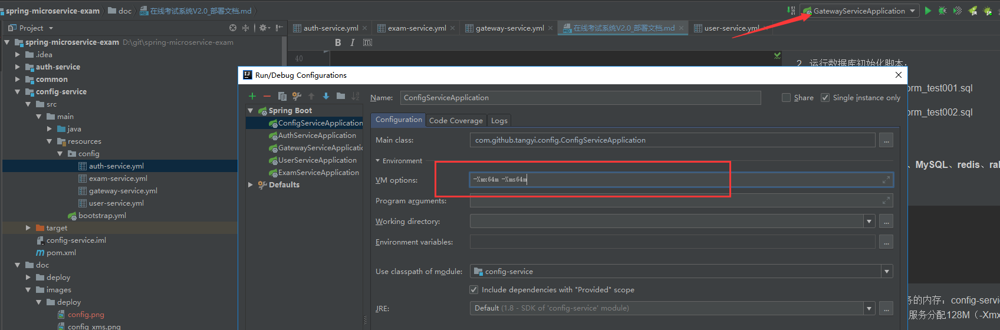
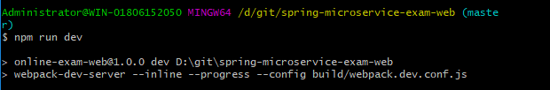
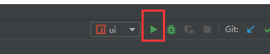

主要介绍如何在本地运行项目，包括下载、导入、修改配置、运行项目

#### 环境准备

开发环境：

- jdk：1.8
- MySQL：5.7+
- redis
- rabbitMq
- node.js
- consul
- fastDfs（推荐基于docker安装，安装步骤网上很多）

开发工具：`IntelliJ IDEA`、`WebStorm`，`IntelliJ IDEA`需要安装插件：`lombok`

#### 项目下载

1. `git clone`下载[spring-microservice-exam](https://gitee.com/wells2333/spring-microservice-exam.git)、[spring-microservice-exam-ui](https://gitee.com/wells2333/spring-microservice-exam-ui.git)、[spring-microservice-exam-web](https://gitee.com/wells2333/spring-microservice-exam-web.git)：

    `git clone https://gitee.com/wells2333/spring-microservice-exam.git`
    
    `git clone https://gitee.com/wells2333/spring-microservice-exam-ui.git`
    
    `git clone https://gitee.com/wells2333/spring-microservice-exam-web.git`

#### 修改配置

1. 修改spring-microservice-exam的config-service的/config文件夹下各服务的配置，主要是数据库、redis和fastDfs，其它配置基本不用动



redis的IP和端口号:



fastDfs的IP和端口号：



2. 运行数据库初始化脚本：

    `/doc/deploy/mysql/microservice-user.sql`
    
    `/doc/deploy/mysql/microservice-exam.sql`
    
    `/doc/deploy/mysql/microservice-auth.sql`

#### 启动后端项目

启动项目前要**先确认consul、MySQL、redis、rabbitMq是否已经启动**

按顺序启动：

    1. config-service
    2. auth-service
    3. user-service
    4. exam-service
    5. gateway-service
    
需要监控功能再启动：

    6. monitor-service
    
内存不足的可以限制每个服务的内存：`config-service`可以分配64M（-Xmx64m -Xms64m）、其它服务分配128M（-Xmx128m -Xms128m）
    
    

#### 启动前端项目

分别在[spring-microservice-exam-ui](https://gitee.com/wells2333/spring-microservice-exam-ui.git)、[spring-microservice-exam-web](https://gitee.com/wells2333/spring-microservice-exam-web.git)目录下，命令行运行：

    npm install

    npm run dev
    
    

 

`WebStorm`导入项目：

 

运行：

 

[spring-microservice-exam-web](https://gitee.com/wells2333/spring-microservice-exam-web.git)项目WebStorm导入操作类似

启动成功后访问：
    
    前台：localhost:8080
        
    后台：localhost:9527
    
默认账号：

1. 管理员：admin/123456

2. 学生：student/123456

3. 教师：teacher/123456

#### 监控
    
|      名称      |   地址    |
| --------- | -------- |
| rabbitMq监控    | localhost:15672  |
| spring boot admin服务监控   | localhost:8085  |
| zipkin链路跟踪   | localhost:9411  |
| consul   | localhost:8500  |

#### 其它

使用keytool生成jwt token密钥库:

```
$ keytool -genkeypair -alias jwt -keyalg RSA -dname "CN=jwt, L=Berlin, S=Berlin, C=DE" -keypass abc123 -keystore jwt.jks -storepass abc123
```

执行下面命令，输入密钥，复制输出的公钥

```
$ keytool -list -rfc --keystore jwt.jks | openssl x509 -inform pem -pubkey
```
